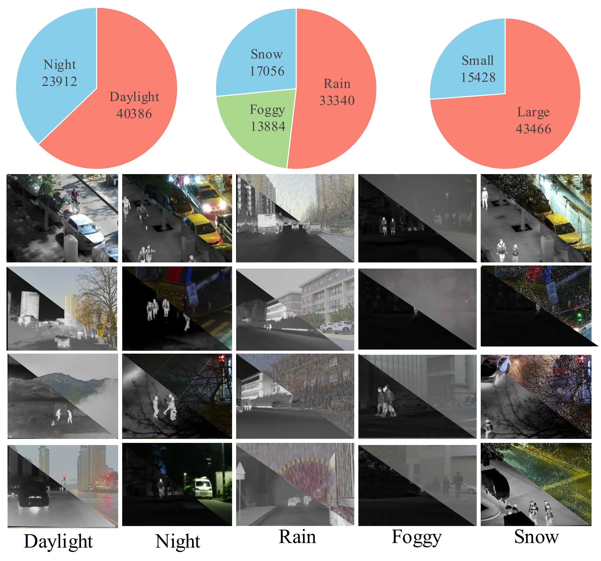

<div align="center">

<h1 align="center"><strong>CFMW: Cross-modality Fusion Mamba for Multispectral Object Detection under Adverse Weather Conditions</strong></h1>
<b>Haoyuan Li, Qi Hu, Binjia Zhou, You Yao, Jiacheng Lin, Kailun Yang<sup>*</sup>, Peng Chen<sup>*</sup></b>

<b>Zhejinag University of Technology, Hunan University, Zhejiang University</b>
<p align="center">
  <a href="https://arxiv.org/pdf/2404.16302" target='_**blank**'>
    
  </a> 
  <a href="https://huggingface.co/datasets/lhy-zju/SWVI/tree/main" target='_blank'>
    
  </a>
</p>
</div>

## 🔍 Overview

### Model
<h1 align="center"></h1>
</p>

### Dataset
<h1 align="center"></h1>
</p>

### Demo
<h1 align="center"></h1>
</p>


## 🏠 About

In this work, we propose the Cross-modality Fusion Mamba with Weather-removal (CFMW) to augment stability and cost-effectiveness under adverse weather conditions. Leveraging the proposed Perturbation-Adaptive Diffusion Model (PADM) and Cross-modality Fusion Mamba (CFM) modules, CFMW is able to reconstruct visual features affected by adverse weather, enriching the representation of image details. To bridge the gap in relevant datasets, we construct a new Severe Weather Visible-Infrared (SWVI) dataset, encompassing diverse adverse weather scenarios such as rain, haze, and snow.

## 🔗 Citation

If you find our work and this codebase helpful, please consider starring this repo 🌟 and cite:

```bibtex
@article{li2024cfmw,
  title={Cfmw: Cross-modality fusion mamba for multispectral object detection under adverse weather conditions},
  author={Li, Haoyuan and Hu, Qi and Yao, You and Yang, Kailun and Chen, Peng},
  journal={arXiv preprint arXiv:2404.16302},
  year={2024}
}
```

## 👏 Acknowledgements
- [YOLOv5](https://github.com/ultralytics/yolov5)
- [CFT](https://github.com/DocF/multispectral-object-detection)
- [Vison Mamba](https://github.com/hustvl/Vim)
- [WeatherDiffusion](https://github.com/IGITUGraz/WeatherDiffusion)
